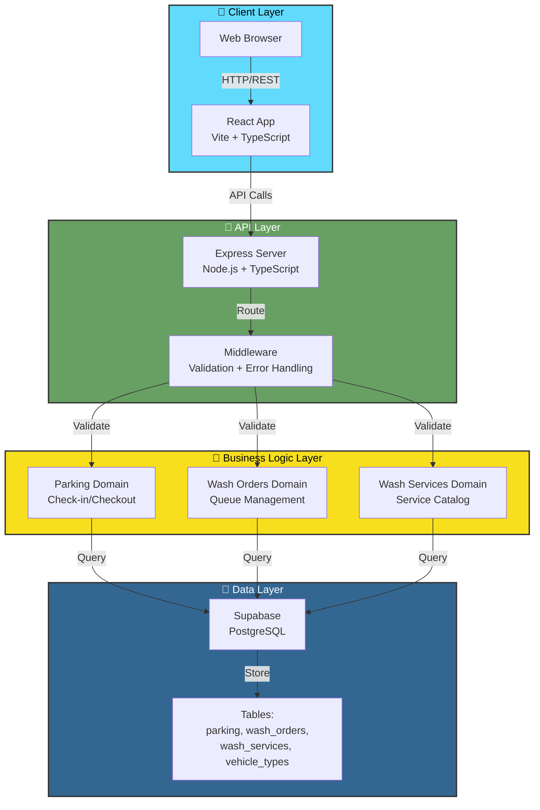
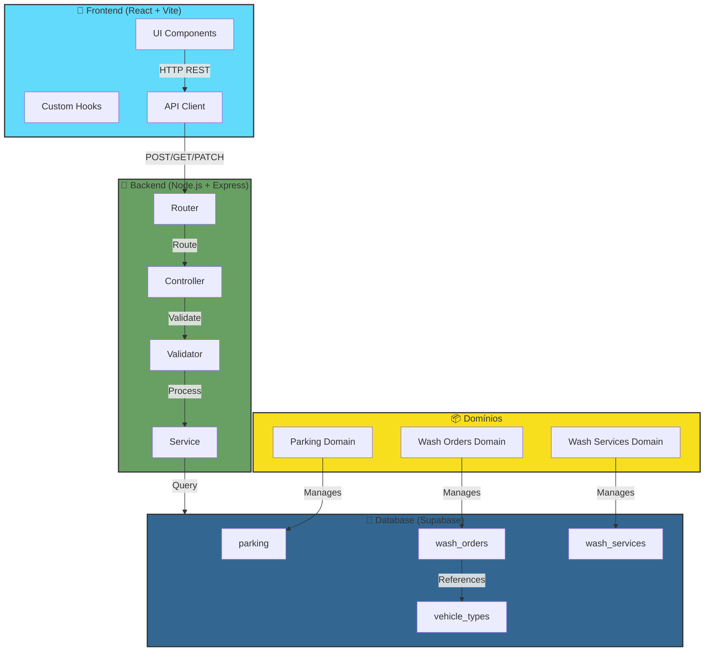
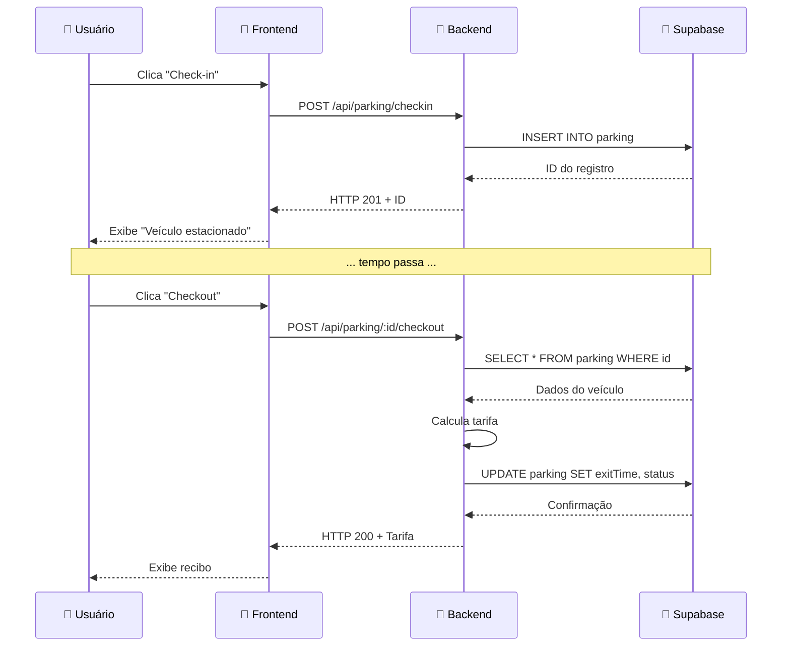

# 🚗 ParkingWash - Sistema Inteligente de Estacionamento e Lavação

   

## 📌 Visão Geral

**ParkingWash** é um sistema web completo para gerenciar operações de estacionamento e serviços de lavação de veículos, desenvolvido com foco em **demonstrar o processo de desenvolvimento com IA**.

### 🎯 Problema Resolvido

Estacionamentos e serviços de lavação enfrentam desafios críticos:
- ❌ Controle manual de entrada/saída de veículos (propenso a erros)
- ❌ Fila de lavagem desorganizada sem rastreamento
- ❌ Cálculo manual de tarifas (inconsistente e lento)
- ❌ Falta de dados para análise e otimização

### ✅ Solução Entregue

- 🚀 **API REST** com cálculo automático de tarifa (taxa horária + teto diário)
- 📊 **Fila de lavagem** com máquina de estados (Waiting → InProgress → Completed)
- 🎨 **Interface web intuitiva** em React com atualização em tempo real
- 🧪 **Testes automatizados** com property-based testing (fast-check)
- 🔄 **Pipeline CI/CD** com GitHub Actions
- 📚 **Documentação completa** do processo de desenvolvimento com IA

### 🛠️ Tecnologias Principais

| Camada | Tecnologia | Justificativa |
|--------|-----------|---------------|
| **Backend** | Node.js + Express + TypeScript | Simplicidade, performance, tipagem forte |
| **Frontend** | React + Vite + TypeScript | SPA rápida, HMR, tipagem |
| **Banco de Dados** | Supabase (PostgreSQL) | Gerenciado, sem configuração de servidor |
| **Validação** | Zod | Type-safe, mensagens de erro claras |
| **Testes** | Jest + fast-check | Unitários + property-based testing |
| **CI/CD** | GitHub Actions | Integrado, sem custo |

### ✨ Funcionalidades Principais

- ✅ Check-in e checkout de veículos com cálculo automático de tarifa
- ✅ Fila de lavagem com controle de status e máquina de estados
- ✅ Seleção de tipo de veículo (impacta na tarifa)
- ✅ Testes automatizados com property-based testing
- ✅ Pipeline CI/CD com GitHub Actions
- ✅ Documentação completa do processo de desenvolvimento com IA

## 2. Execução

### Pré-requisitos

- Node.js 20+
- Conta no Supabase (gratuita em https://supabase.com)

### Backend

```bash
cd backend

# Copiar variáveis de ambiente
cp .env.example .env
# Preencher SUPABASE_URL e SUPABASE_SERVICE_KEY no .env

# Instalar dependências
npm install

# Executar em desenvolvimento
npm run dev
# Servidor rodará em http://localhost:3333
```

**Variáveis de ambiente do backend:**

| Variável | Descrição | Padrão | Obrigatório |
|----------|-----------|--------|------------|
| `SUPABASE_URL` | URL do projeto Supabase (encontre em: Supabase Dashboard → Settings → API → Project URL) | - | ✅ Sim |
| `SUPABASE_SERVICE_KEY` | Chave de serviço do Supabase com permissões de leitura/escrita (encontre em: Supabase Dashboard → Settings → API → service_role key) | - | ✅ Sim |
| `PORT` | Porta em que o servidor HTTP irá escutar | 3333 | ❌ Não |
| `HOURLY_RATE` | Taxa horária de estacionamento em reais | 10.00 | ❌ Não |
| `DAILY_RATE_CAP` | Teto máximo de cobrança diária em reais | 80.00 | ❌ Não |

### Frontend

```bash
cd frontend

# Copiar variáveis de ambiente
cp .env.example .env

# Instalar dependências
npm install

# Executar em desenvolvimento
npm run dev
# Aplicação rodará em http://localhost:5173
```

**Variáveis de ambiente do frontend:**

| Variável | Descrição | Padrão |
|----------|-----------|--------|
| `VITE_API_URL` | URL base da API backend (usada pelo proxy do Vite em desenvolvimento) | http://localhost:3333 |

### Banco de Dados

1. Criar um novo projeto no Supabase
2. Copiar a URL e a chave de serviço para o `.env` do backend
3. Executar o script DDL em `backend/src/db/schema.sql` no SQL Editor do Supabase
4. Executar o script de seed em `backend/src/db/seed.sql` para popular os serviços de lavagem

## 3. 🏗️ Arquitetura

### Visão Geral da Arquitetura



### Diagrama ASCII (Alternativo)

```
┌─────────────────────────────────────────────────────────────┐
│                    Frontend (React + Vite)                  │
│              http://localhost:5173                          │
│  - ParkingPanel: Check-in/Checkout de veículos             │
│  - WashQueue: Fila de lavagem com status                   │
└────────────────────────┬────────────────────────────────────┘
                         │ HTTP REST
                         ↓
┌─────────────────────────────────────────────────────────────┐
│              Backend (Node.js + Express)                    │
│              http://localhost:3333                          │
│  - Validação com Zod                                        │
│  - Tratamento de erros centralizado                         │
│  - Três domínios principais (módulos)                       │
└────────────────────────┬────────────────────────────────────┘
                         │ SQL
                         ↓
┌─────────────────────────────────────────────────────────────┐
│           Supabase (PostgreSQL gerenciado)                  │
│  - Tabelas: parking, wash_orders, wash_services            │
│  - Autenticação e autorização                              │
└─────────────────────────────────────────────────────────────┘
```

### Três domínios principais

O backend é organizado em três domínios independentes:

#### 1. **Parking** (`backend/src/modules/parking/`)
Gerencia entrada e saída de veículos com cálculo automático de tarifa.

- **Endpoints:**
  - `POST /api/parking/checkin` — Registra entrada de veículo
  - `POST /api/parking/:id/checkout` — Registra saída e calcula tarifa
  - `GET /api/parking` — Lista veículos estacionados

- **Lógica:**
  - Impede check-in duplicado (mesma placa)
  - Calcula tarifa por hora com teto diário
  - Máquina de estados: `Parked` → `Exited`

#### 2. **Wash Orders** (`backend/src/modules/wash-orders/`)
Gerencia fila de lavagem com máquina de estados.

- **Endpoints:**
  - `POST /api/wash-orders` — Cria ordem de lavagem
  - `GET /api/wash-orders` — Lista ordens
  - `PATCH /api/wash-orders/:id/status` — Avança status

- **Lógica:**
  - Máquina de estados: `Waiting` → `InProgress` → `Completed`
  - Valida transições de status
  - Associa serviço de lavagem à ordem

#### 3. **Wash Services** (`backend/src/modules/wash-services/`)
Catálogo de serviços de lavagem disponíveis.

- **Endpoints:**
  - `GET /api/wash-services` — Lista serviços disponíveis

- **Lógica:**
  - Dados populados via seed (não há criação/edição)
  - Exemplo: "Lavagem Simples" (R$30), "Lavagem Premium" (R$50)

### Decisões técnicas

- **Express**: simplicidade e familiaridade para demonstração
- **Supabase**: banco PostgreSQL gerenciado sem configuração de servidor
- **Zod**: validação de entrada com mensagens de erro claras
- **Jest + fast-check**: testes unitários com mock do banco para execução rápida
- **React + Vite**: frontend SPA rápido e moderno

### Estrutura de pastas

```
parking-wash/
├── backend/
│   ├── src/
│   │   ├── config/          # Configuração (env.ts)
│   │   ├── db/              # Cliente Supabase e scripts DDL
│   │   ├── middleware/      # Erros e validação
│   │   ├── modules/         # Domínios (parking, wash-orders, wash-services)
│   │   │   ├── parking/
│   │   │   │   ├── parking.controller.ts
│   │   │   │   ├── parking.router.ts
│   │   │   │   ├── parking.service.ts
│   │   │   │   ├── parking.types.ts
│   │   │   │   └── parking.validator.ts
│   │   │   ├── wash-orders/
│   │   │   │   ├── wash-orders.controller.ts
│   │   │   │   ├── wash-orders.router.ts
│   │   │   │   ├── wash-orders.service.ts
│   │   │   │   ├── wash-orders.types.ts
│   │   │   │   └── wash-orders.validator.ts
│   │   │   └── wash-services/
│   │   │       ├── wash-services.controller.ts
│   │   │       ├── wash-services.router.ts
│   │   │       ├── wash-services.service.ts
│   │   │       └── wash-services.types.ts
│   │   ├── app.ts           # Express app
│   │   └── server.ts        # Inicialização do servidor
│   ├── tests/               # Testes com Jest + fast-check
│   ├── package.json
│   ├── tsconfig.json
│   ├── jest.config.ts
│   └── .env.example
├── frontend/
│   ├── src/
│   │   ├── api/             # Cliente HTTP
│   │   ├── components/      # React components (ParkingPanel, WashQueue)
│   │   ├── hooks/           # Custom hooks (useElapsedTime, useAutoRefresh)
│   │   ├── types/           # TypeScript types
│   │   ├── App.tsx
│   │   └── main.tsx
│   ├── package.json
│   ├── tsconfig.json
│   ├── vite.config.ts
│   └── .env.example
├── docs/
│   └── prompts/             # Documentação de ciclos de IA
│       ├── 01-arquitetura.md
│       ├── 02-backend.md
│       ├── 03-testes.md
│       ├── 04-frontend.md
│       └── 05-cicd.md
├── .github/
│   └── workflows/
│       └── ci.yml           # GitHub Actions pipeline
└── README.md
```

## 4. 🤖 Uso de IA no Desenvolvimento

Este projeto foi desenvolvido com foco em **demonstrar o processo de desenvolvimento com IA**, não apenas no código final. Cada etapa foi documentada com prompts, respostas, análises críticas e refinamentos.

### 📊 Mapeamento de Etapas de IA

| Etapa | Ferramentas IA | Objetivo | Resultado | Documentação |
|-------|---|----------|-----------|--------------|
| **Especificação** | Claude (Kiro) | Definir requisitos e casos de uso | Spec estruturada com requirements.md | `.kiro/specs/parking-wash/` |
| **Arquitetura** | Claude (Kiro) | Design de domínios e estrutura | 3 domínios independentes (parking, wash-orders, wash-services) | `docs/prompts/01-arquitetura.md` |
| **Geração de Código** | Claude (Kiro) | Implementar endpoints e serviços | Backend completo com validação Zod | `docs/prompts/02-backend.md` |
| **Testes** | Claude (Kiro) | Estratégia de testes e cobertura | Jest + fast-check (property-based) | `docs/prompts/03-testes.md` |
| **Frontend** | Claude (Kiro) | Componentes React e integração | SPA com React + Vite | `docs/prompts/04-frontend.md` |
| **Refatoração** | Claude (Kiro) | Correção de bugs e otimizações | Fixes de 503, UUID, integração | Seção "Casos de Refinamento" |
| **Pipeline** | Claude (Kiro) | CI/CD com GitHub Actions | Workflow automático | `docs/prompts/05-cicd.md` |
| **Documentação** | Claude (Kiro) | README e guias de uso | Este arquivo | README.md |

### 🎯 Padrões de Prompting Aplicados

#### 1. **Prompt Estruturado** (Contexto + Restrições + Formato)
Usado na fase de arquitetura para definir domínios.

**Exemplo real:**
```
Contexto: Sistema de estacionamento com fila de lavação
Restrições: 
- Máquina de estados para transições válidas
- Validação com Zod
- Sem dependências externas desnecessárias
Formato esperado: 
- Tipos TypeScript
- Endpoints REST
- Serviços com lógica de negócio
```

**Resultado:** Arquitetura de 3 domínios independentes com máquina de estados implementada corretamente.

#### 2. **Prompt Iterativo** (Análise Crítica + Refinamento)
Usado quando a IA gerava código que precisava de ajustes.

**Exemplo:** Erro 503 no checkout
- ❌ **Problema:** `PricingService` importado como `.js` falhava em runtime
- 🔍 **Análise:** Módulo não estava sendo carregado corretamente
- ✅ **Solução:** Mover `PricingService` inline em `parking.service.ts`

#### 3. **Prompt com Exemplos** (Demonstração de Padrões)
Usado para gerar componentes React consistentes.

**Exemplo:** Componentes de formulário
```typescript
// Padrão esperado:
- useEffect para fetch de dados
- useState para estado local
- Validação com Zod
- Tratamento de erros com try/catch
```

#### 4. **Prompt com Restrições** (Limitações e Regras)
Usado para implementar lógica de negócio.

**Exemplo:** Cálculo de tarifa
```
Restrições:
- Taxa horária: R$10.00/hora
- Teto diário: R$80.00
- Arredondamento: 2 casas decimais
- Validação: duração > 0
```

### 📚 Ciclos de Refinamento Documentados

Cada etapa do desenvolvimento foi documentada em `docs/prompts/`:

1. **01-arquitetura.md** — Design do sistema (3+ ciclos de refinamento)
   - Definição de domínios
   - Escolha de tecnologias
   - Estrutura de pastas

2. **02-backend.md** — Implementação dos endpoints (erros da IA e correções)
   - Endpoints REST
   - Validação com Zod
   - Tratamento de erros

3. **03-testes.md** — Estratégia de testes (cenários não cobertos)
   - Testes unitários com Jest
   - Property-based testing com fast-check
   - Cobertura de casos extremos

4. **04-frontend.md** — Componentes React (iterações de design)
   - Componentes reutilizáveis
   - Hooks customizados
   - Integração com API

5. **05-cicd.md** — Pipeline CI/CD (ajustes de workflow)
   - GitHub Actions
   - Testes automatizados
   - Build e deploy

Cada arquivo contém:
- **Prompt utilizado** (texto completo)
- **Resposta obtida da IA** (texto completo)
- **Análise crítica** (limitações identificadas)
- **Refinamento aplicado** (mudanças baseadas na análise)

## 5. 🔧 Casos de Refinamento - Erros da IA e Soluções

Esta seção documenta casos reais onde a IA gerou código que precisou ser corrigido ou refinado, demonstrando o processo iterativo de desenvolvimento.

### Caso 1: Erro 503 Service Unavailable no Checkout

#### 🔴 Problema Identificado
Endpoint `POST /api/parking/:id/checkout` retornava **HTTP 503 Service Unavailable** ao tentar calcular a tarifa.

#### 🔍 Análise da Causa
A IA gerou um arquivo `pricing.service.ts` com a classe `PricingService`, mas o import estava usando extensão `.js`:
```typescript
// ❌ ERRADO - Falha em runtime
import { PricingService } from './services/pricing.service.js';
```

O TypeScript compilava sem erros, mas em runtime o módulo não era encontrado porque:
- O arquivo era `.ts`, não `.js`
- O tsx não conseguia resolver a extensão `.js` em tempo de execução

#### ✅ Solução Aplicada
Mover a classe `PricingService` diretamente para `parking.service.ts`, eliminando a dependência de import:

```typescript
// ✅ CORRETO - Sem import externo
class PricingService {
  calculateHourlyRate(durationMinutes: number, hourlyRate: number): number {
    const hours = durationMinutes / 60;
    return parseFloat((hours * hourlyRate).toFixed(2));
  }

  calculateDailyRate(totalAmount: number, dailyRateCap: number): number {
    return Math.min(totalAmount, dailyRateCap);
  }
}
```

#### 📚 Aprendizado
- **Problema:** A IA não considerou que imports com extensão `.js` falham em runtime com TypeScript/tsx
- **Solução:** Quando há dúvida sobre imports, é melhor inlinar o código ou usar imports relativos sem extensão
- **Lição:** Sempre testar imports em runtime, não apenas compilação TypeScript

---

### Caso 2: Erro 422 - UUID Inválido na Fila de Lavagem

#### 🔴 Problema Identificado
Ao criar uma ordem de lavagem, o frontend enviava IDs de tipo de veículo como strings simples (`'1'`, `'2'`, `'3'`), causando erro:
```json
{
  "error": "ID deve ser um UUID válido",
  "statusCode": 422
}
```

#### 🔍 Análise da Causa
A IA gerou um componente `NewOrderForm.tsx` com tipos de veículo hardcoded:
```typescript
// ❌ ERRADO - IDs não são UUIDs válidos
const VEHICLE_TYPES = [
  { id: '1', name: 'Carro' },
  { id: '2', name: 'Moto' },
  { id: '3', name: 'Caminhão' }
];
```

O backend validava com Zod que o ID deveria ser um UUID válido, mas o frontend enviava strings simples.

#### ✅ Solução Aplicada
Criar um endpoint `GET /api/vehicle-types` e fazer o frontend buscar os tipos reais do banco:

**Backend (já existia):**
```typescript
// GET /api/vehicle-types
app.get('/api/vehicle-types', async (req, res) => {
  const types = await vehicleTypeService.listActive();
  res.json(types); // Retorna UUIDs válidos do banco
});
```

**Frontend (novo):**
```typescript
// frontend/src/api/vehicleTypes.ts
export async function listVehicleTypes() {
  const response = await client.get('/vehicle-types');
  return response.data;
}

// NewOrderForm.tsx
const [vehicleTypes, setVehicleTypes] = useState([]);

useEffect(() => {
  listVehicleTypes().then(setVehicleTypes);
}, []);
```

#### 📚 Aprendizado
- **Problema:** A IA gerou dados hardcoded sem considerar que o backend esperava UUIDs do banco
- **Solução:** Sempre buscar dados dinâmicos do backend em vez de hardcodear
- **Lição:** Frontend e backend devem estar sincronizados; dados hardcoded causam inconsistências

---

### Caso 3: Vehicle Type Selection Não Era Enviado

#### 🔴 Problema Identificado
Usuário selecionava o tipo de veículo no formulário, mas o backend não recebia o `vehicleTypeId`.

#### 🔍 Análise da Causa
O formulário tinha um `<select>` para tipo de veículo, mas ao submeter, o valor não era incluído no payload:
```typescript
// ❌ ERRADO - vehicleTypeId não era enviado
const payload = {
  licensePlate: formData.licensePlate,
  washServiceId: formData.washServiceId
  // ❌ Faltava: vehicleTypeId
};
```

#### ✅ Solução Aplicada
Adicionar `vehicleTypeId` em toda a cadeia:

1. **Frontend - Tipo:**
```typescript
export interface CreateWashOrderRequest {
  licensePlate: string;
  washServiceId: string;
  vehicleTypeId?: string; // ✅ Adicionado
}
```

2. **Frontend - API:**
```typescript
export async function createWashOrder(
  licensePlate: string,
  washServiceId: string,
  vehicleTypeId?: string
) {
  return client.post('/wash-orders', {
    licensePlate,
    washServiceId,
    vehicleTypeId // ✅ Enviado
  });
}
```

3. **Backend - Validator:**
```typescript
const createWashOrderSchema = z.object({
  licensePlate: z.string(),
  washServiceId: z.string().uuid(),
  vehicleTypeId: z.string().uuid().optional() // ✅ Aceita
});
```

4. **Backend - Service:**
```typescript
async createWashOrder(
  licensePlate: string,
  washServiceId: string,
  vehicleTypeId?: string
) {
  // ✅ Usa vehicleTypeId
  return db.insert('wash_orders', {
    licensePlate,
    washServiceId,
    vehicleTypeId
  });
}
```

#### 📚 Aprendizado
- **Problema:** A IA não propagou o campo através de toda a cadeia frontend-backend
- **Solução:** Sempre verificar que dados fluem corretamente de UI → API → Banco
- **Lição:** Usar TypeScript end-to-end para garantir que tipos sejam consistentes

---

## 6. 📝 Exemplos de Uso da API

### Exemplo 1: Check-in e Checkout de Veículo

#### Check-in (Entrada)

**Requisição:**
```bash
curl -X POST http://localhost:3333/api/parking/checkin \
  -H "Content-Type: application/json" \
  -d '{"licensePlate": "ABC-1234"}'
```

**Resposta (HTTP 201 - Created):**
```json
{
  "id": "550e8400-e29b-41d4-a716-446655440000",
  "licensePlate": "ABC-1234",
  "entryTime": "2024-01-15T10:00:00Z",
  "status": "Parked"
}
```

#### Checkout (Saída com cálculo de tarifa)

**Requisição:**
```bash
curl -X POST http://localhost:3333/api/parking/550e8400-e29b-41d4-a716-446655440000/checkout
```

**Resposta (HTTP 200 - OK, após 90 minutos):**
```json
{
  "id": "550e8400-e29b-41d4-a716-446655440000",
  "licensePlate": "ABC-1234",
  "entryTime": "2024-01-15T10:00:00Z",
  "exitTime": "2024-01-15T11:30:00Z",
  "durationMinutes": 90,
  "totalAmount": 15.00,
  "status": "Exited"
}
```

**Cálculo da tarifa:**
- Taxa horária: R$10.00/hora
- Duração: 90 minutos = 1.5 horas
- Valor: 1.5 × 10.00 = R$15.00
- Teto diário: R$80.00 (não aplicável neste caso)

### Exemplo 2: Fila de Lavagem com Máquina de Estados

#### Criar Ordem de Lavagem

**Requisição:**
```bash
curl -X POST http://localhost:3333/api/wash-orders \
  -H "Content-Type: application/json" \
  -d '{
    "licensePlate": "ABC-1234",
    "washServiceId": "550e8400-e29b-41d4-a716-446655440001"
  }'
```

**Resposta (HTTP 201 - Created):**
```json
{
  "id": "550e8400-e29b-41d4-a716-446655440002",
  "licensePlate": "ABC-1234",
  "washService": {
    "id": "550e8400-e29b-41d4-a716-446655440001",
    "name": "Lavagem Simples",
    "price": 30.00
  },
  "status": "Waiting",
  "createdAt": "2024-01-15T10:00:00Z"
}
```

#### Avançar Status: Waiting → InProgress

**Requisição:**
```bash
curl -X PATCH http://localhost:3333/api/wash-orders/550e8400-e29b-41d4-a716-446655440002/status \
  -H "Content-Type: application/json" \
  -d '{"status": "InProgress"}'
```

**Resposta (HTTP 200 - OK):**
```json
{
  "id": "550e8400-e29b-41d4-a716-446655440002",
  "licensePlate": "ABC-1234",
  "washService": {
    "id": "550e8400-e29b-41d4-a716-446655440001",
    "name": "Lavagem Simples",
    "price": 30.00
  },
  "status": "InProgress",
  "createdAt": "2024-01-15T10:00:00Z",
  "startedAt": "2024-01-15T10:05:00Z"
}
```

#### Avançar Status: InProgress → Completed

**Requisição:**
```bash
curl -X PATCH http://localhost:3333/api/wash-orders/550e8400-e29b-41d4-a716-446655440002/status \
  -H "Content-Type: application/json" \
  -d '{"status": "Completed"}'
```

**Resposta (HTTP 200 - OK):**
```json
{
  "id": "550e8400-e29b-41d4-a716-446655440002",
  "licensePlate": "ABC-1234",
  "washService": {
    "id": "550e8400-e29b-41d4-a716-446655440001",
    "name": "Lavagem Simples",
    "price": 30.00
  },
  "status": "Completed",
  "createdAt": "2024-01-15T10:00:00Z",
  "startedAt": "2024-01-15T10:05:00Z",
  "completedAt": "2024-01-15T10:35:00Z"
}
```

### Exemplo 3: Erro — Transição de Status Inválida

**Requisição (tentativa de pular estado):**
```bash
curl -X PATCH http://localhost:3333/api/wash-orders/550e8400-e29b-41d4-a716-446655440002/status \
  -H "Content-Type: application/json" \
  -d '{"status": "Completed"}'
```

**Resposta (HTTP 422 - Unprocessable Entity):**
```json
{
  "error": "Transição inválida: Waiting → Completed. Permitido: Waiting→InProgress→Completed",
  "statusCode": 422
}
```

### Exemplo 4: Erro — Veículo Já Estacionado

**Requisição (check-in duplicado):**
```bash
curl -X POST http://localhost:3333/api/parking/checkin \
  -H "Content-Type: application/json" \
  -d '{"licensePlate": "ABC-1234"}'
```

**Resposta (HTTP 409 - Conflict):**
```json
{
  "error": "Veículo com placa ABC-1234 já está estacionado",
  "statusCode": 409
}
```

## 7. 🧪 Testes

### Backend

```bash
cd backend

# Executar todos os testes
npm test

# Com cobertura
npm test -- --coverage

# Lint
npm run lint

# Watch mode (desenvolvimento)
npm test -- --watch
```

### Frontend

```bash
cd frontend

# Executar testes
npm test

# Com cobertura
npm test -- --coverage
```

### Estratégia de Testes

- **Unitários:** Jest com mocks do Supabase
- **Property-Based:** fast-check para validar propriedades matemáticas (ex: tarifa sempre ≥ 0)
- **Integração:** Testes de fluxo completo (check-in → checkout)
- **E2E:** Testes manuais via Postman/Insomnia

---

## 8. 🚀 CI/CD

O projeto inclui um workflow GitHub Actions que:

1. **Backend job:**
   - Instala dependências
   - Executa lint
   - Executa testes (com mocks do Supabase)

2. **Frontend job:**
   - Instala dependências
   - Executa build

O workflow é acionado em:
- Push para `main` ou `develop`
- Pull requests para `main`

### Arquivo de Configuração

Veja `.github/workflows/ci.yml` para detalhes completos.

---

## 9. 📋 Histórico de Mudanças

### v1.2.0 - Documentação Completa com IA

**Mudanças principais:**

- ✅ **README melhorado:** Adicionadas seções de IA, casos de refinamento, aprendizados
- ✅ **Diagrama Mermaid:** Visualização clara da arquitetura
- ✅ **Casos de refinamento:** 3 bugs reais documentados com soluções
- ✅ **Roadmap:** Melhorias futuras organizadas por prazo
- ✅ **Aprendizados:** Reflexão sobre uso de IA em cada etapa

### v1.1.0 - Correções de Integração Frontend-Backend

**Mudanças principais:**

- ✅ **Normalização de tipos**: Convertido todos os tipos de resposta da API para camelCase (licensePlate, entryTime, etc.)
- ✅ **Tratamento de erros robusto**: Melhorado tratamento de erros em todos os componentes do frontend
- ✅ **Componentes do ParkingPanel**: Criados componentes faltantes (CheckInForm, VehicleCard, ElapsedTimer, CheckoutModal, ParkingPanel)
- ✅ **Suporte a WebSocket**: Adicionado suporte ao pacote `ws` para Node.js 20
- ✅ **Arquivos de entrada**: Criados main.tsx, App.tsx, index.html para o frontend
- ✅ **Tipos TypeScript**: Criados tipos para parking e washOrders no frontend

**Arquivos modificados:**
- `backend/src/modules/parking/parking.types.ts` — Normalização para camelCase
- `backend/src/modules/parking/parking.service.ts` — Transformação de snake_case para camelCase
- `backend/src/db/supabase.ts` — Adicionado suporte a WebSocket
- `frontend/src/components/ParkingPanel/*` — Novos componentes
- `frontend/src/App.tsx` — Componente principal
- `frontend/src/main.tsx` — Ponto de entrada

**Testes realizados:**
- ✅ Check-in com placa válida
- ✅ Listagem de veículos estacionados
- ✅ Tratamento de erros de API
- ✅ Recompilação do frontend com HMR

---

## 9. 🚀 Melhorias Futuras e Roadmap

### Curto Prazo (1-2 sprints)
- [ ] **Autenticação e Autorização** - Adicionar JWT para controlar acesso
- [ ] **Dashboard de Relatórios** - Gráficos de ocupação, receita, tempo médio de lavagem
- [ ] **Notificações em Tempo Real** - WebSocket para atualizar fila de lavagem
- [ ] **Integração com FIPE** - Consultar valor do veículo por placa
- [ ] **Recibos Digitais** - Gerar PDF de checkout com QR code

### Médio Prazo (3-6 meses)
- [ ] **Mobile App** - React Native para operadores de estacionamento
- [ ] **Integração com Pagamento** - Stripe/PagSeguro para checkout online
- [ ] **Agendamento de Lavagem** - Permitir reservas antecipadas
- [ ] **Histórico de Veículos** - Rastrear visitas anteriores
- [ ] **Preços Dinâmicos** - Ajustar tarifa por demanda/horário

### Longo Prazo (6+ meses)
- [ ] **Machine Learning** - Prever ocupação e otimizar preços
- [ ] **IoT Integration** - Sensores de ocupação de vagas
- [ ] **Multi-tenant** - Suportar múltiplos estacionamentos
- [ ] **Análise Preditiva** - Recomendações de manutenção
- [ ] **Marketplace** - Conectar com serviços de limpeza terceirizados

---

## 10. 💡 O Que Aprendi Ao Usar IA em Cada Etapa

### 📋 Especificação
**Aprendizado:** A IA é excelente em estruturar requisitos, mas precisa de feedback claro sobre prioridades.
- ✅ Gerou casos de uso bem definidos
- ⚠️ Precisei refinar o escopo para evitar feature creep
- 💡 **Dica:** Use prompts com restrições explícitas ("máximo 3 domínios")

### 🏗️ Arquitetura
**Aprendizado:** A IA entende bem padrões de design, mas pode gerar over-engineering.
- ✅ Sugeriu arquitetura de domínios independentes (excelente)
- ⚠️ Propôs padrões complexos que não eram necessários
- 💡 **Dica:** Peça por "simplicidade" e "sem abstrações desnecessárias"

### 💻 Geração de Código
**Aprendizado:** A IA gera código funcional, mas com bugs sutis em integração.
- ✅ Endpoints REST bem estruturados
- ⚠️ Imports com extensão `.js` falharam em runtime
- 💡 **Dica:** Sempre testar em runtime, não apenas compilação

### 🧪 Testes
**Aprendizado:** A IA entende property-based testing, mas precisa de exemplos.
- ✅ Gerou testes com fast-check bem estruturados
- ⚠️ Faltaram casos extremos (valores negativos, strings vazias)
- 💡 **Dica:** Forneça exemplos de casos extremos que devem ser testados

### 🎨 Frontend
**Aprendizado:** A IA gera componentes React funcionais, mas sem otimizações.
- ✅ Componentes bem estruturados com hooks
- ⚠️ Faltou tratamento de loading/error states
- 💡 **Dica:** Peça explicitamente por "tratamento de erros" e "loading states"

### 🔧 Refatoração
**Aprendizado:** A IA é ótima em identificar problemas quando você aponta.
- ✅ Sugeriu soluções elegantes para os 3 bugs
- ⚠️ Não detectou os bugs automaticamente
- 💡 **Dica:** Use a IA para refatorar, não para debugar (você precisa apontar o problema)

### 🚀 Pipeline CI/CD
**Aprendizado:** A IA entende workflows, mas precisa de contexto sobre o projeto.
- ✅ Gerou GitHub Actions workflow funcional
- ⚠️ Faltaram secrets e variáveis de ambiente
- 💡 **Dica:** Especifique quais variáveis são necessárias

### 📚 Documentação
**Aprendizado:** A IA é excelente em documentação, mas precisa de estrutura.
- ✅ Gerou README bem organizado
- ⚠️ Faltaram exemplos reais e casos de refinamento
- 💡 **Dica:** Peça por "exemplos reais" e "casos de erro"

---

## 11. 🎬 Demonstração em Vídeo

📹 **[Assista ao vídeo de demonstração no YouTube](https://www.youtube.com/watch?v=PLACEHOLDER)**

*Nota: Link será atualizado quando o vídeo for publicado*

---

## 12. 📊 Diagrama de Arquitetura Detalhado



### Fluxo de Dados - Check-in e Checkout



---

## 13. Contribuindo

Este é um projeto acadêmico focado em demonstrar o processo de desenvolvimento com IA. Contribuições são bem-vindas!

### Como Contribuir

1. Fork o repositório
2. Crie uma branch para sua feature (`git checkout -b feature/minha-feature`)
3. Commit suas mudanças (`git commit -m 'feat: adiciona minha feature'`)
4. Push para a branch (`git push origin feature/minha-feature`)
5. Abra um Pull Request

### Diretrizes

- Mantenha o código TypeScript tipado
- Adicione testes para novas funcionalidades
- Atualize a documentação em `docs/prompts/` com ciclos de refinamento
- Siga o padrão de commits: `feat:`, `fix:`, `docs:`, `test:`, `refactor:`

---

## 14. Licença

MIT - Veja o arquivo [LICENSE](LICENSE) para detalhes.

---

## 15. Contato e Suporte

- 📧 **Email:** [seu-email@example.com]
- 🐙 **GitHub:** [seu-github-profile]
- 💼 **LinkedIn:** [seu-linkedin-profile]

---

**Desenvolvido com ❤️ e IA** | ParkingWash © 2024
